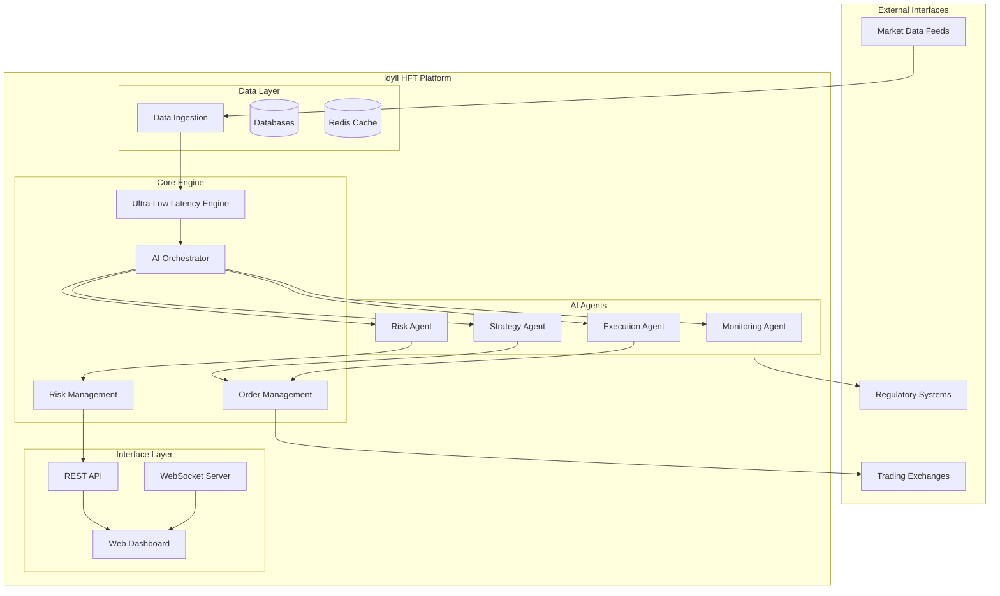

# Software Requirements Specification (SRS)
# Idyll Intelligent Systems - Automated HFT Platform

## Table of Contents
1. [Introduction](#1-introduction)
2. [Overall Description](#2-overall-description)
3. [System Features](#3-system-features)
4. [Non-Functional Requirements](#4-non-functional-requirements)
5. [System Architecture](#5-system-architecture)
6. [Technology Stack](#6-technology-stack)
7. [Interface Requirements](#7-interface-requirements)
8. [Performance Requirements](#8-performance-requirements)
9. [Security Requirements](#9-security-requirements)
10. [Testing Requirements](#10-testing-requirements)

---

## 1. Introduction

### 1.1 Purpose
This Software Requirements Specification (SRS) document describes the functional and non-functional requirements for the Idyll Intelligent Systems Automated High-Frequency Trading (HFT) Platform. The system is designed to execute nanosecond-precision automated trading operations across global financial markets using artificial intelligence and machine learning technologies.

### 1.2 Scope
The Idyll HFT Platform encompasses:
- **Ultra-low latency trading engine** capable of sub-microsecond execution
- **Multi-agent AI system** for autonomous trading decisions
- **Real-time risk management** with dynamic position sizing
- **Smart order routing** across multiple exchanges
- **Comprehensive monitoring and analytics** dashboard
- **Automated market making** and arbitrage strategies
- **Global market connectivity** supporting major exchanges worldwide

### 1.3 Definitions and Acronyms

| Term | Definition |
|------|------------|
| HFT | High-Frequency Trading |
| AI | Artificial Intelligence |
| ML | Machine Learning |
| VaR | Value at Risk |
| FPGA | Field-Programmable Gate Array |
| SOR | Smart Order Routing |
| API | Application Programming Interface |
| FIX | Financial Information eXchange Protocol |
| TWAP | Time-Weighted Average Price |
| VWAP | Volume-Weighted Average Price |
| P&L | Profit and Loss |

### 1.4 References
- IEEE 830-1998 Standard for Software Requirements Specifications
- FIX Protocol Specifications 4.4/5.0
- ISO 27001 Information Security Management
- MiFID II Regulatory Requirements

---

## 2. Overall Description

### 2.1 Product Perspective
The Idyll HFT Platform is an enterprise-grade, standalone trading system designed to operate autonomously in global financial markets. It integrates with:
- **Trading Venues**: NYSE, NASDAQ, CME, ICE, LSE, Euronext, and others
- **Market Data Providers**: Bloomberg, Reuters, proprietary feeds
- **Risk Management Systems**: Real-time monitoring and compliance
- **Regulatory Reporting**: Automated trade reporting and audit trails

### 2.2 Product Functions

#### Core Functions:
1. **Strategy Generation**: AI-powered creation and optimization of trading strategies
2. **Signal Processing**: Real-time analysis of market data and signal generation
3. **Order Management**: Intelligent order routing and execution optimization
4. **Risk Control**: Dynamic risk assessment and position management
5. **Performance Analytics**: Real-time P&L tracking and performance metrics
6. **System Monitoring**: Comprehensive health monitoring and alerting

#### Advanced Functions:
1. **Market Making**: Automated liquidity provision with optimal spread management
2. **Arbitrage Detection**: Cross-exchange and cross-asset arbitrage opportunities
3. **Momentum Trading**: Trend-following strategies with adaptive parameters
4. **Mean Reversion**: Statistical arbitrage based on price deviation analysis
5. **News Analytics**: NLP-based sentiment analysis for event-driven trading

### 2.3 User Classes and Characteristics

| User Class | Description | Technical Expertise | Usage Frequency |
|------------|-------------|-------------------|-----------------|
| Trading Directors | Strategic oversight and risk management | High | Daily |
| Quantitative Analysts | Strategy development and optimization | Very High | Daily |
| Risk Managers | Risk monitoring and compliance | High | Continuous |
| System Administrators | Platform maintenance and monitoring | Very High | Continuous |
| Compliance Officers | Regulatory oversight and reporting | Medium | Daily |

### 2.4 Operating Environment

#### Hardware Requirements:
- **Primary Servers**: Dell PowerEdge R760 or equivalent
- **CPU**: Intel Xeon Gold 6300 series (minimum 32 cores)
- **Memory**: 256GB DDR4 ECC RAM (minimum)
- **Storage**: NVMe SSD arrays with 100,000+ IOPS
- **Network**: 100Gbps dedicated fiber connections
- **Co-location**: Tier-1 data centers with <0.5ms exchange proximity

#### Software Environment:
- **Operating System**: Ubuntu 22.04 LTS (optimized kernel)
- **Runtime**: Node.js 20+ with V8 performance optimizations
- **Database**: MongoDB 7.0, Redis 7.0, InfluxDB 2.0
- **Message Queue**: Apache Kafka 3.0 for real-time data streaming
- **Monitoring**: Prometheus + Grafana for metrics and alerting

---

## 3. System Features

### 3.1 Ultra-Low Latency Engine

#### 3.1.1 Description
Core trading engine designed for nanosecond-precision order processing and execution.

#### 3.1.2 Functional Requirements
- **REQ-3.1.1**: Process market data updates within 100 nanoseconds
- **REQ-3.1.2**: Generate trading signals within 200 nanoseconds
- **REQ-3.1.3**: Execute order placement within 500 nanoseconds
- **REQ-3.1.4**: Maintain order book updates with <50ns latency
- **REQ-3.1.5**: Support kernel bypass networking (DPDK)
- **REQ-3.1.6**: Implement memory pool allocation for zero-copy operations

#### 3.1.3 Performance Criteria
- **Latency**: <2 microseconds end-to-end execution
- **Throughput**: >1 million orders per second
- **Jitter**: <100 nanoseconds 99.9th percentile
- **Availability**: 99.99% uptime during trading hours

### 3.2 AI Agent Orchestrator

#### 3.2.1 Description
Multi-agent artificial intelligence system coordinating autonomous trading decisions.

#### 3.2.2 Functional Requirements
- **REQ-3.2.1**: Coordinate 4+ specialized AI agents (Strategy, Risk, Execution, Monitoring)
- **REQ-3.2.2**: Implement consensus-based decision making with confidence scoring
- **REQ-3.2.3**: Provide real-time agent performance tracking and optimization
- **REQ-3.2.4**: Support dynamic agent weight adjustment based on performance
- **REQ-3.2.5**: Enable emergency override and manual intervention capabilities
- **REQ-3.2.6**: Maintain agent state persistence and recovery mechanisms

#### 3.2.3 AI Agent Specifications

##### Strategy Agent
- **Purpose**: Generate and optimize trading strategies
- **ML Models**: LSTM, Transformer, reinforcement learning
- **Features**: Pattern recognition, regime detection, strategy adaptation
- **Performance**: >80% signal accuracy, <100ms decision time

##### Risk Agent
- **Purpose**: Real-time risk assessment and control
- **Capabilities**: VaR calculation, stress testing, correlation analysis
- **Limits**: Position limits, exposure limits, drawdown controls
- **Response**: <50ms risk evaluation, automatic position reduction

##### Execution Agent
- **Purpose**: Optimize order routing and execution
- **Algorithms**: TWAP, VWAP, POV, implementation shortfall
- **Features**: Venue selection, timing optimization, slippage minimization
- **Performance**: >95% fill rate, minimal market impact

##### Monitoring Agent
- **Purpose**: System health and performance monitoring
- **Metrics**: Latency, throughput, error rates, P&L tracking
- **Alerting**: Real-time anomaly detection and notification
- **Recovery**: Automated failover and system recovery

### 3.3 Market Data Processing

#### 3.3.1 Description
Real-time market data ingestion, normalization, and distribution system.

#### 3.3.2 Functional Requirements
- **REQ-3.3.1**: Ingest data from 20+ exchanges simultaneously
- **REQ-3.3.2**: Normalize data formats across different venues
- **REQ-3.3.3**: Maintain synchronized order books with microsecond precision
- **REQ-3.3.4**: Detect and handle data anomalies automatically
- **REQ-3.3.5**: Store tick-by-tick data for historical analysis
- **REQ-3.3.6**: Provide real-time data quality monitoring

### 3.4 Order Management System

#### 3.4.1 Description
Intelligent order routing and execution management with multi-venue connectivity.

#### 3.4.2 Functional Requirements
- **REQ-3.4.1**: Support FIX 4.4/5.0 protocol for exchange connectivity
- **REQ-3.4.2**: Implement smart order routing with venue selection optimization
- **REQ-3.4.3**: Provide multiple execution algorithms (TWAP, VWAP, POV, etc.)
- **REQ-3.4.4**: Maintain real-time order status tracking and updates
- **REQ-3.4.5**: Support partial fills and order amendment capabilities
- **REQ-3.4.6**: Implement automatic order retry and failover mechanisms

### 3.5 Risk Management System

#### 3.5.1 Description
Comprehensive risk monitoring and control system with real-time position tracking.

#### 3.5.2 Functional Requirements
- **REQ-3.5.1**: Calculate real-time Value at Risk (VaR) with 95% and 99% confidence
- **REQ-3.5.2**: Monitor position limits by symbol, sector, and portfolio level
- **REQ-3.5.3**: Implement dynamic leverage adjustment based on market conditions
- **REQ-3.5.4**: Perform stress testing with historical and Monte Carlo scenarios
- **REQ-3.5.5**: Provide automatic position reduction when limits are breached
- **REQ-3.5.6**: Generate real-time risk reports and compliance dashboards

### 3.6 Web Dashboard Interface

#### 3.6.1 Description
Real-time web-based monitoring and control interface for system oversight.

#### 3.6.2 Functional Requirements
- **REQ-3.6.1**: Display real-time P&L, positions, and performance metrics
- **REQ-3.6.2**: Provide interactive charts with millisecond data updates
- **REQ-3.6.3**: Enable manual trading controls and emergency stop functionality
- **REQ-3.6.4**: Support multi-user access with role-based permissions
- **REQ-3.6.5**: Implement responsive design for desktop and mobile access
- **REQ-3.6.6**: Provide system health monitoring and alert notifications

---

## 4. Non-Functional Requirements

### 4.1 Performance Requirements

#### 4.1.1 Latency Requirements
- **Order Processing**: <500 nanoseconds
- **Market Data Processing**: <100 nanoseconds
- **Risk Calculations**: <200 nanoseconds
- **Web Dashboard Updates**: <100 milliseconds
- **Database Queries**: <10 milliseconds

#### 4.1.2 Throughput Requirements
- **Market Data**: 10 million ticks per second
- **Order Processing**: 1 million orders per second
- **Trade Executions**: 100,000 trades per second
- **Risk Calculations**: 1,000 VaR calculations per second

#### 4.1.3 Capacity Requirements
- **Concurrent Users**: 100 web dashboard users
- **Data Storage**: 10TB daily market data retention
- **Memory Usage**: <80% of available system memory
- **CPU Utilization**: <70% during peak trading hours

### 4.2 Reliability Requirements

#### 4.2.1 Availability
- **System Uptime**: 99.99% during trading hours
- **Planned Maintenance**: <2 hours monthly outside trading hours
- **Recovery Time**: <60 seconds for system restart
- **Data Backup**: Real-time replication with <1 second RPO

#### 4.2.2 Fault Tolerance
- **Hardware Failure**: Automatic failover within 30 seconds
- **Network Interruption**: Automatic reconnection within 10 seconds
- **Exchange Connectivity**: Multi-path routing with redundancy
- **Data Center Outage**: Cross-region failover capability

### 4.3 Scalability Requirements
- **Horizontal Scaling**: Support for 10+ trading nodes
- **Vertical Scaling**: Utilize up to 128 CPU cores per node
- **Geographic Distribution**: Support for multi-region deployment
- **Exchange Expansion**: Easy addition of new trading venues

### 4.4 Security Requirements
- **Encryption**: AES-256 for data at rest, TLS 1.3 for data in transit
- **Authentication**: Multi-factor authentication for all users
- **Authorization**: Role-based access control with audit logging
- **Network Security**: VPN and firewall protection with intrusion detection

---

## 5. System Architecture

### 5.1 High-Level Architecture



### 5.2 Component Architecture

#### 5.2.1 Ultra-Low Latency Engine


#### 5.2.2 AI Agent System


### 5.3 Data Flow Architecture


---

## 6. Technology Stack

### 6.1 Core Technologies

| Component | Technology | Version | Purpose |
|-----------|------------|---------|---------|
| Runtime | Node.js | 20+ | Core application runtime |
| Language | TypeScript/JavaScript | ES2023 | Primary programming language |
| Web Framework | Express.js | 4.18+ | REST API and web services |
| Real-time Communication | Socket.IO | 4.7+ | WebSocket communication |
| Database | MongoDB | 7.0+ | Operational data storage |
| Cache | Redis | 7.0+ | High-speed data caching |
| Time-Series DB | InfluxDB | 2.7+ | Market data and metrics |
| Message Queue | Apache Kafka | 3.0+ | Event streaming |
| Machine Learning | TensorFlow.js | 4.0+ | AI/ML model execution |

### 6.2 Infrastructure Technologies

| Component | Technology | Purpose |
|-----------|------------|---------|
| Containerization | Docker | Application packaging |
| Orchestration | Kubernetes | Container orchestration |
| Monitoring | Prometheus + Grafana | Metrics and visualization |
| Logging | ELK Stack | Centralized logging |
| CI/CD | GitLab CI | Automated deployment |
| Load Balancing | NGINX | Traffic distribution |
| Security | Vault | Secrets management |

### 6.3 Financial Technologies

| Component | Technology | Purpose |
|-----------|------------|---------|
| Trading Protocol | FIX 4.4/5.0 | Exchange connectivity |
| Market Data | Binary protocols | Low-latency data feeds |
| Risk Engine | Custom C++ libraries | Ultra-fast calculations |
| Time Synchronization | PTP/NTP | Microsecond precision |
| Network Optimization | DPDK | Kernel bypass networking |

---

## 7. Interface Requirements

### 7.1 User Interfaces

#### 7.1.1 Web Dashboard
- **Responsive Design**: Support for desktop (1920x1080+) and tablet (1024x768+)
- **Real-time Updates**: Sub-second chart and metrics updates
- **Interactive Charts**: TradingView-style candlestick and line charts
- **Control Panels**: Trading controls, risk limits, system settings
- **Multi-language**: English, Chinese, Japanese support

#### 7.1.2 Mobile Interface
- **Progressive Web App**: Native app experience in browsers
- **Essential Metrics**: P&L, positions, system status
- **Emergency Controls**: Trading halt, position closure
- **Push Notifications**: Critical alerts and system events

### 7.2 Hardware Interfaces

#### 7.2.1 Network Interfaces
- **10GbE/100GbE**: Primary trading network connections
- **FPGA Cards**: Hardware acceleration for critical paths
- **GPS Timing**: Nanosecond-precision time synchronization
- **Backup Connectivity**: Secondary network paths for redundancy

#### 7.2.2 Storage Interfaces
- **NVMe SSD**: Primary storage for databases and logs
- **Network Storage**: Secondary storage for historical data
- **Backup Systems**: Automated backup to multiple locations

### 7.3 Software Interfaces

#### 7.3.1 Exchange APIs
- **FIX Protocol**: Native FIX 4.4/5.0 implementation
- **Binary Protocols**: Exchange-specific optimized protocols
- **REST APIs**: HTTP-based interfaces for non-latency-critical operations
- **WebSocket**: Real-time data streaming where supported

#### 7.3.2 Data Provider APIs
- **Bloomberg API**: Professional market data integration
- **Reuters Elektron**: Real-time and historical data feeds
- **Proprietary Feeds**: Direct exchange market data connections
- **Alternative Data**: News, social sentiment, economic indicators

### 7.4 Communication Interfaces

#### 7.4.1 Internal Communication
- **Message Queue**: Apache Kafka for reliable event streaming
- **Service Mesh**: Istio for microservice communication
- **gRPC**: High-performance inter-service communication
- **WebSocket**: Real-time client-server communication

#### 7.4.2 External Communication
- **VPN Tunnels**: Secure connectivity to exchanges and data providers
- **Dedicated Lines**: Low-latency connections to major venues
- **Satellite Backup**: Redundant connectivity for disaster recovery
- **Regulatory Reporting**: Automated compliance data transmission

---

## 8. Performance Requirements

### 8.1 Latency Requirements

#### 8.1.1 Trading Latency Targets
| Operation | Target Latency | Maximum Acceptable |
|-----------|----------------|-------------------|
| Market Data Processing | 100ns | 500ns |
| Signal Generation | 200ns | 1μs |
| Risk Check | 200ns | 500ns |
| Order Generation | 300ns | 1μs |
| Order Transmission | 500ns | 2μs |
| End-to-End Execution | 2μs | 10μs |

#### 8.1.2 System Response Times
| Interface | Target Response | Maximum Acceptable |
|-----------|-----------------|-------------------|
| Web Dashboard | 100ms | 500ms |
| REST API | 50ms | 200ms |
| WebSocket Updates | 10ms | 50ms |
| Database Queries | 5ms | 20ms |
| Cache Operations | 1ms | 5ms |

### 8.2 Throughput Requirements

#### 8.2.1 Trading Throughput
- **Market Data**: 10M ticks/second sustained, 50M burst
- **Order Processing**: 1M orders/second sustained, 5M burst
- **Trade Executions**: 100K trades/second sustained
- **Risk Calculations**: 10K VaR calculations/second

#### 8.2.2 System Throughput
- **Database Operations**: 100K operations/second
- **Cache Operations**: 1M operations/second
- **Web Requests**: 10K requests/second
- **WebSocket Messages**: 100K messages/second

### 8.3 Resource Utilization

#### 8.3.1 CPU Utilization
- **Trading Hours**: <70% average, <90% peak
- **Off-Hours**: <30% average
- **Core Allocation**: Dedicated cores for trading threads
- **NUMA Optimization**: Memory and CPU affinity optimization

#### 8.3.2 Memory Utilization
- **System Memory**: <80% of total available
- **Cache Memory**: <60% for optimal performance
- **Memory Pools**: Pre-allocated pools for zero-copy operations
- **Garbage Collection**: <1ms pause times

#### 8.3.3 Network Utilization
- **Bandwidth**: <50% of available capacity during normal operations
- **Packet Loss**: <0.001% under normal conditions
- **Jitter**: <100ns 99.9th percentile
- **Connection Pooling**: Optimized connection reuse

### 8.4 Scalability Requirements

#### 8.4.1 Horizontal Scaling
- **Trading Nodes**: Scale to 20+ nodes
- **Database Sharding**: Automatic data partitioning
- **Load Distribution**: Intelligent workload balancing
- **Geographic Distribution**: Multi-region deployment support

#### 8.4.2 Vertical Scaling
- **CPU Cores**: Utilize up to 128 cores per node
- **Memory**: Support up to 1TB RAM per node
- **Storage**: Scale to 100TB+ per node
- **Network**: 100GbE+ network interfaces

---

## 9. Security Requirements

### 9.1 Authentication and Authorization

#### 9.1.1 User Authentication
- **Multi-Factor Authentication**: Required for all user access
- **Strong Password Policy**: Minimum 12 characters, complexity requirements
- **Session Management**: Secure session tokens with expiration
- **Account Lockout**: Automatic lockout after failed attempts

#### 9.1.2 Authorization Controls
- **Role-Based Access**: Granular permissions by user role
- **Principle of Least Privilege**: Minimum necessary access rights
- **Audit Logging**: Complete access and action logging
- **Privileged Access Management**: Special controls for admin accounts

### 9.2 Data Protection

#### 9.2.1 Encryption
- **Data at Rest**: AES-256 encryption for all stored data
- **Data in Transit**: TLS 1.3 for all network communications
- **Key Management**: Hardware security modules (HSM) for key storage
- **Certificate Management**: Automated certificate lifecycle management

#### 9.2.2 Data Privacy
- **Data Classification**: Sensitive data identification and labeling
- **Data Masking**: PII masking in non-production environments
- **Data Retention**: Automated data lifecycle management
- **Data Anonymization**: Anonymous data for analytics and testing

### 9.3 Network Security

#### 9.3.1 Network Protection
- **Firewall Rules**: Restrictive inbound/outbound traffic rules
- **Intrusion Detection**: Real-time network monitoring and alerting
- **VPN Access**: Secure remote access for authorized users
- **Network Segmentation**: Isolated networks for different components

#### 9.3.2 Application Security
- **Input Validation**: Comprehensive input sanitization
- **SQL Injection Prevention**: Parameterized queries and ORM protection
- **Cross-Site Scripting (XSS)**: Content security policy implementation
- **API Security**: Rate limiting, input validation, and authentication

### 9.4 Compliance and Auditing

#### 9.4.1 Regulatory Compliance
- **MiFID II**: Transaction reporting and record keeping
- **GDPR**: Data protection and privacy compliance
- **SOX**: Financial reporting controls and audit trails
- **PCI DSS**: Payment card data security standards

#### 9.4.2 Audit Requirements
- **Audit Trails**: Immutable logs of all system activities
- **Log Retention**: 7-year retention for trading-related logs
- **Log Analysis**: Automated analysis for security events
- **Compliance Reporting**: Automated regulatory report generation

---

## 10. Testing Requirements

### 10.1 Test Strategy

#### 10.1.1 Testing Phases
1. **Unit Testing**: Component-level testing with >90% coverage
2. **Integration Testing**: Inter-component communication testing
3. **System Testing**: End-to-end system functionality testing
4. **Performance Testing**: Latency and throughput validation
5. **Security Testing**: Vulnerability assessment and penetration testing
6. **User Acceptance Testing**: Business requirements validation

#### 10.1.2 Test Environments
- **Development**: Individual developer testing environment
- **Integration**: Continuous integration testing environment
- **Staging**: Production-like environment for pre-deployment testing
- **Performance**: Dedicated environment for performance testing
- **Production**: Live trading environment with monitoring

### 10.2 Historical Data Testing

#### 10.2.1 COVID Phase Testing (2020-2021)
- **Market Conditions**: High volatility, low liquidity crisis scenarios
- **Test Duration**: 500 trading days of historical data
- **Scenarios**: Market crash, recovery rally, second wave uncertainty
- **Success Criteria**: 
  - Maintain system stability during extreme volatility
  - Risk controls prevent excessive losses
  - Latency targets met under stress conditions

#### 10.2.2 Normal Phase Testing (2022-2024)
- **Market Conditions**: Normal volatility, good liquidity scenarios
- **Test Duration**: 630 trading days of recent data
- **Scenarios**: Steady growth, interest rate changes, economic normalization
- **Success Criteria**:
  - Strategy performance meets target metrics
  - System operates efficiently under normal conditions
  - AI agents demonstrate consistent decision-making

### 10.3 Performance Testing

#### 10.3.1 Latency Testing
- **Market Data Processing**: <100ns target latency
- **Order Processing**: <500ns target latency
- **Risk Calculations**: <200ns target latency
- **End-to-End Execution**: <2μs target latency
- **Web Dashboard**: <100ms response time

#### 10.3.2 Throughput Testing
- **Market Data**: 10M ticks/second sustained processing
- **Order Processing**: 1M orders/second sustained processing
- **Database Operations**: 100K operations/second
- **Concurrent Users**: 100 simultaneous web dashboard users

#### 10.3.3 Stress Testing
- **High Volatility**: 400% volatility spike scenarios
- **Market Crash**: 35% market drop simulation
- **Low Liquidity**: 60% liquidity reduction scenarios
- **Flash Crash**: Rapid price movement testing
- **System Overload**: Maximum capacity testing

### 10.4 Security Testing

#### 10.4.1 Vulnerability Assessment
- **Automated Scanning**: OWASP Top 10 vulnerability testing
- **Manual Testing**: Expert security assessment
- **Code Review**: Static analysis for security flaws
- **Dependency Scanning**: Third-party library vulnerability checks

#### 10.4.2 Penetration Testing
- **External Testing**: Simulated external attack attempts
- **Internal Testing**: Privilege escalation and lateral movement
- **Social Engineering**: Phishing and social attack simulation
- **Physical Security**: Data center and hardware security testing

### 10.5 Test Automation

#### 10.5.1 Automated Testing Framework
- **Unit Tests**: Jest/Mocha for JavaScript testing
- **Integration Tests**: Supertest for API testing
- **E2E Tests**: Playwright for web interface testing
- **Performance Tests**: Custom framework for latency testing
- **Load Tests**: K6 for high-volume testing

#### 10.5.2 Continuous Testing
- **CI/CD Integration**: Automated testing in deployment pipeline
- **Regression Testing**: Automated testing of existing functionality
- **Performance Monitoring**: Continuous latency and throughput monitoring
- **Security Scanning**: Automated vulnerability scanning in CI/CD

---

## Appendices

### Appendix A: UML Diagrams

#### A.1 System Context Diagram


#### A.2 Component Diagram


#### A.3 Sequence Diagram - Trade Execution


### Appendix B: Database Schema

#### B.1 Trading Tables
```sql
-- Orders table
CREATE TABLE orders (
    order_id VARCHAR(50) PRIMARY KEY,
    symbol VARCHAR(20) NOT NULL,
    side ENUM('BUY', 'SELL') NOT NULL,
    quantity DECIMAL(15,6) NOT NULL,
    price DECIMAL(15,6),
    order_type ENUM('MARKET', 'LIMIT', 'STOP') NOT NULL,
    status ENUM('NEW', 'FILLED', 'CANCELLED', 'REJECTED') NOT NULL,
    timestamp TIMESTAMP(6) NOT NULL,
    agent_id VARCHAR(50),
    strategy_id VARCHAR(50),
    INDEX idx_symbol_timestamp (symbol, timestamp),
    INDEX idx_status_timestamp (status, timestamp)
);

-- Trades table
CREATE TABLE trades (
    trade_id VARCHAR(50) PRIMARY KEY,
    order_id VARCHAR(50) NOT NULL,
    symbol VARCHAR(20) NOT NULL,
    side ENUM('BUY', 'SELL') NOT NULL,
    quantity DECIMAL(15,6) NOT NULL,
    price DECIMAL(15,6) NOT NULL,
    commission DECIMAL(15,6) NOT NULL,
    timestamp TIMESTAMP(6) NOT NULL,
    exchange VARCHAR(20) NOT NULL,
    FOREIGN KEY (order_id) REFERENCES orders(order_id),
    INDEX idx_symbol_timestamp (symbol, timestamp),
    INDEX idx_exchange_timestamp (exchange, timestamp)
);

-- Positions table
CREATE TABLE positions (
    position_id VARCHAR(50) PRIMARY KEY,
    symbol VARCHAR(20) NOT NULL,
    quantity DECIMAL(15,6) NOT NULL,
    average_price DECIMAL(15,6) NOT NULL,
    unrealized_pnl DECIMAL(15,6) NOT NULL,
    realized_pnl DECIMAL(15,6) NOT NULL,
    timestamp TIMESTAMP(6) NOT NULL,
    UNIQUE KEY uk_symbol (symbol),
    INDEX idx_timestamp (timestamp)
);
```

#### B.2 Risk Management Tables
```sql
-- Risk limits table
CREATE TABLE risk_limits (
    limit_id VARCHAR(50) PRIMARY KEY,
    limit_type ENUM('POSITION', 'EXPOSURE', 'VAR', 'DRAWDOWN') NOT NULL,
    symbol VARCHAR(20),
    sector VARCHAR(50),
    limit_value DECIMAL(15,6) NOT NULL,
    current_value DECIMAL(15,6) NOT NULL,
    utilization_pct DECIMAL(5,2) NOT NULL,
    status ENUM('OK', 'WARNING', 'BREACH') NOT NULL,
    timestamp TIMESTAMP(6) NOT NULL,
    INDEX idx_type_status (limit_type, status),
    INDEX idx_symbol (symbol)
);

-- VaR calculations table
CREATE TABLE var_calculations (
    var_id VARCHAR(50) PRIMARY KEY,
    portfolio_id VARCHAR(50) NOT NULL,
    confidence_level DECIMAL(5,2) NOT NULL,
    time_horizon INT NOT NULL,
    var_amount DECIMAL(15,6) NOT NULL,
    calculation_method ENUM('PARAMETRIC', 'HISTORICAL', 'MONTE_CARLO') NOT NULL,
    timestamp TIMESTAMP(6) NOT NULL,
    INDEX idx_portfolio_timestamp (portfolio_id, timestamp)
);
```

### Appendix C: API Specifications

#### C.1 REST API Endpoints

##### Trading Operations
```yaml
/api/v1/orders:
  post:
    summary: Submit new order
    requestBody:
      required: true
      content:
        application/json:
          schema:
            type: object
            properties:
              symbol:
                type: string
                example: "AAPL"
              side:
                type: string
                enum: [BUY, SELL]
              quantity:
                type: number
                example: 1000
              price:
                type: number
                example: 150.25
              orderType:
                type: string
                enum: [MARKET, LIMIT, STOP]
    responses:
      201:
        description: Order created successfully
        content:
          application/json:
            schema:
              type: object
              properties:
                orderId:
                  type: string
                status:
                  type: string
                timestamp:
                  type: string

/api/v1/positions:
  get:
    summary: Get current positions
    responses:
      200:
        description: Current positions
        content:
          application/json:
            schema:
              type: array
              items:
                type: object
                properties:
                  symbol:
                    type: string
                  quantity:
                    type: number
                  averagePrice:
                    type: number
                  unrealizedPnL:
                    type: number
                  realizedPnL:
                    type: number

/api/v1/metrics:
  get:
    summary: Get system metrics
    responses:
      200:
        description: System performance metrics
        content:
          application/json:
            schema:
              type: object
              properties:
                latency:
                  type: object
                  properties:
                    average:
                      type: number
                    p99:
                      type: number
                throughput:
                  type: object
                  properties:
                    ordersPerSecond:
                      type: number
                    tradesPerSecond:
                      type: number
                pnl:
                  type: object
                  properties:
                    daily:
                      type: number
                    total:
                      type: number
```

##### Risk Management
```yaml
/api/v1/risk/limits:
  get:
    summary: Get risk limits
    responses:
      200:
        description: Current risk limits and utilization
  
  put:
    summary: Update risk limits
    requestBody:
      required: true
      content:
        application/json:
          schema:
            type: object
            properties:
              limitType:
                type: string
                enum: [POSITION, EXPOSURE, VAR, DRAWDOWN]
              symbol:
                type: string
              limitValue:
                type: number

/api/v1/risk/var:
  get:
    summary: Get VaR calculations
    parameters:
      - name: confidence
        in: query
        schema:
          type: number
          enum: [95, 99]
      - name: horizon
        in: query
        schema:
          type: integer
          enum: [1, 10]
    responses:
      200:
        description: VaR calculation results

/api/v1/emergency-stop:
  post:
    summary: Emergency trading halt
    responses:
      200:
        description: Emergency stop activated
```

#### C.2 WebSocket Events

##### Market Data Events
```javascript
// Market data tick
{
  "event": "marketTick",
  "data": {
    "symbol": "AAPL",
    "price": 150.25,
    "volume": 1000,
    "timestamp": "2024-07-27T10:30:15.123456Z"
  }
}

// Order book update
{
  "event": "orderBookUpdate",
  "data": {
    "symbol": "AAPL",
    "bids": [
      {"price": 150.20, "size": 1000},
      {"price": 150.19, "size": 500}
    ],
    "asks": [
      {"price": 150.21, "size": 800},
      {"price": 150.22, "size": 1200}
    ],
    "timestamp": "2024-07-27T10:30:15.123456Z"
  }
}
```

##### Trading Events
```javascript
// Order update
{
  "event": "orderUpdate",
  "data": {
    "orderId": "ORD-123456",
    "status": "FILLED",
    "filledQuantity": 1000,
    "averagePrice": 150.25,
    "timestamp": "2024-07-27T10:30:15.123456Z"
  }
}

// Trade execution
{
  "event": "tradeExecution",
  "data": {
    "tradeId": "TRD-789012",
    "orderId": "ORD-123456",
    "symbol": "AAPL",
    "side": "BUY",
    "quantity": 1000,
    "price": 150.25,
    "commission": 1.50,
    "timestamp": "2024-07-27T10:30:15.123456Z"
  }
}

// P&L update
{
  "event": "pnlUpdate",
  "data": {
    "symbol": "AAPL",
    "position": 1000,
    "unrealizedPnL": 1250.00,
    "realizedPnL": 500.00,
    "totalPnL": 1750.00,
    "timestamp": "2024-07-27T10:30:15.123456Z"
  }
}
```

##### System Events
```javascript
// System status update
{
  "event": "systemStatus",
  "data": {
    "status": "OPTIMAL",
    "latency": {
      "average": 742,
      "p99": 1250
    },
    "throughput": {
      "ordersPerSecond": 125000,
      "tradesPerSecond": 8500
    },
    "uptime": "99.99%",
    "timestamp": "2024-07-27T10:30:15.123456Z"
  }
}

// Risk alert
{
  "event": "riskAlert",
  "data": {
    "alertType": "POSITION_LIMIT",
    "severity": "WARNING",
    "message": "Position limit approaching for AAPL",
    "symbol": "AAPL",
    "currentValue": 95000,
    "limitValue": 100000,
    "utilization": 95.0,
    "timestamp": "2024-07-27T10:30:15.123456Z"
  }
}

// Emergency event
{
  "event": "emergencyStop",
  "data": {
    "reason": "MANUAL_TRIGGER",
    "triggeredBy": "user123",
    "message": "Trading halted by emergency stop",
    "timestamp": "2024-07-27T10:30:15.123456Z"
  }
}
```

---

## Document Control

| Version | Date | Author | Changes |
|---------|------|--------|---------|
| 1.0 | 2024-07-27 | Idyll Systems Team | Initial SRS document |
| 1.1 | 2024-07-27 | Technical Lead | Added UML diagrams and API specs |
| 1.2 | 2024-07-27 | System Architect | Enhanced architecture details |

**Document Status**: Final Draft  
**Classification**: Confidential  
**Next Review Date**: 2024-10-27  

---

*This document contains proprietary and confidential information of Idyll Intelligent Systems. Any reproduction or distribution without written consent is strictly prohibited.*
