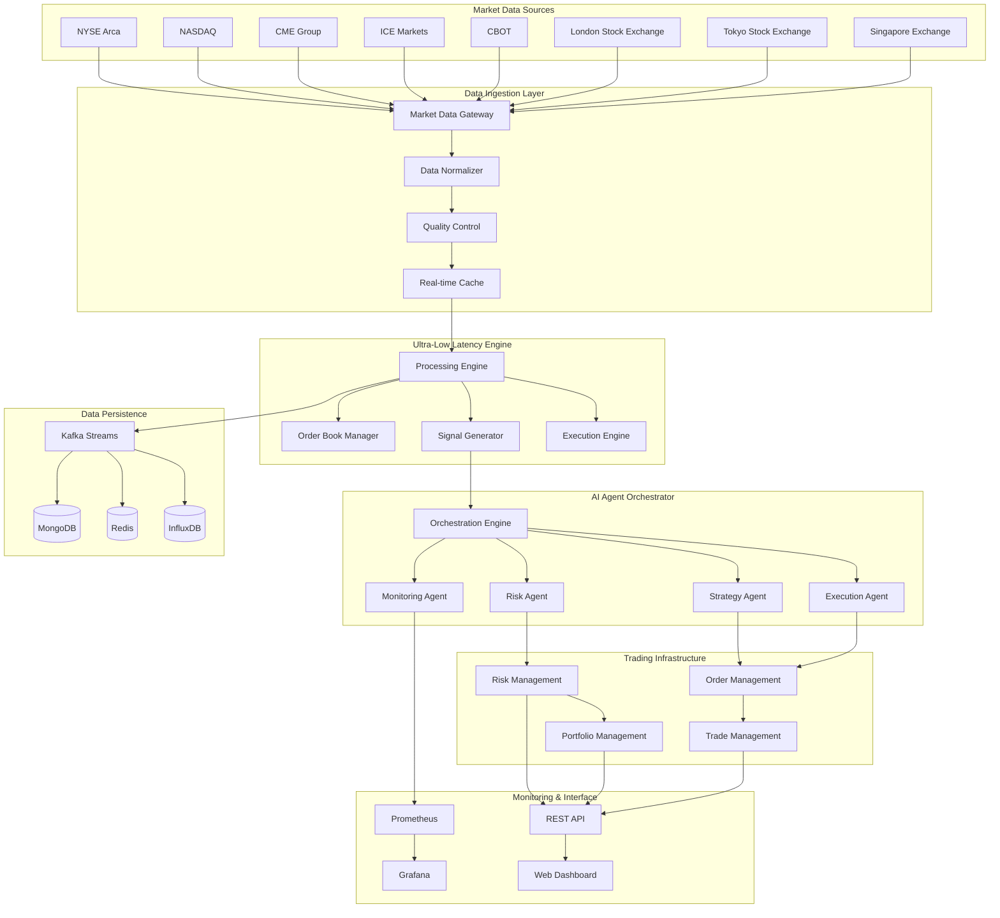
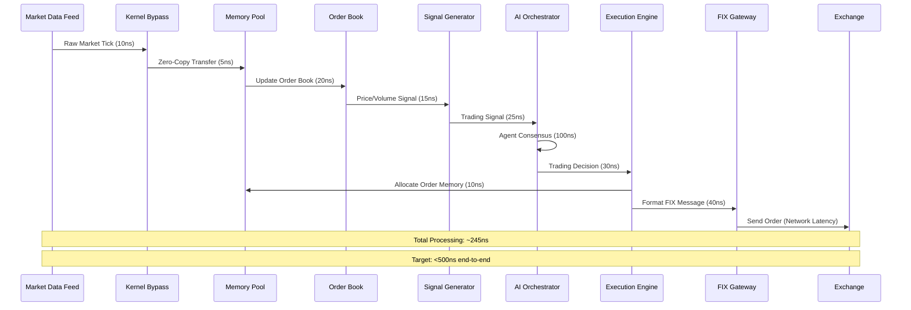
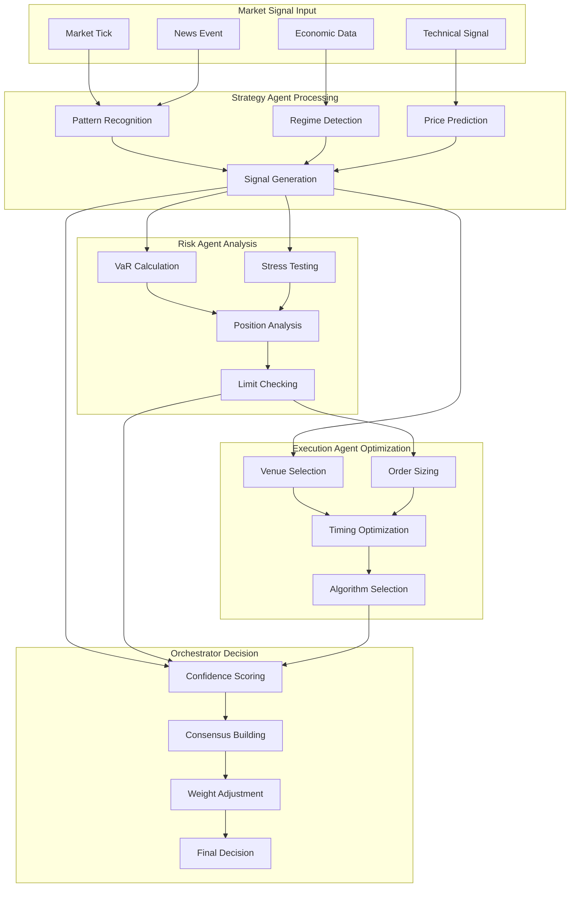
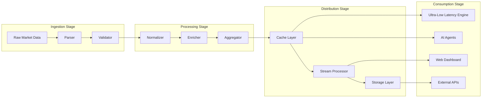
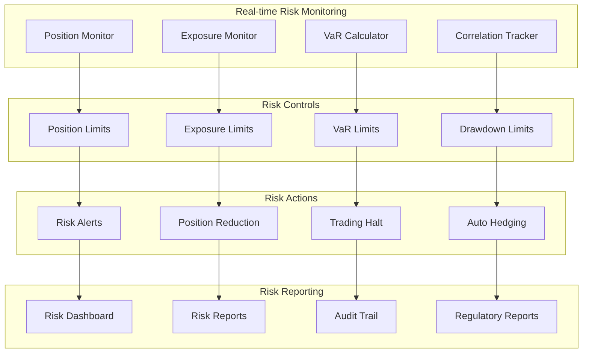
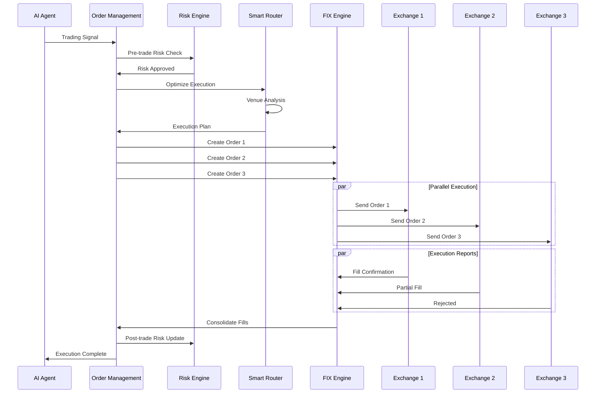
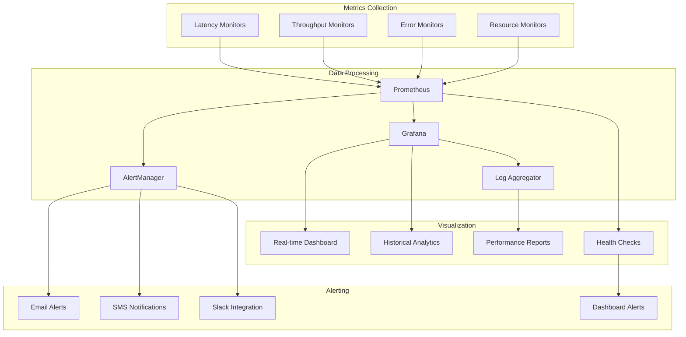

# Idyll Intelligent Systems - Technology Architecture Guide

## System Flow Diagrams & Component Overview

### 1. High-Level System Architecture



### 2. Ultra-Low Latency Engine Flow



### 3. AI Agent Decision Flow



### 4. Data Processing Pipeline



### 5. Risk Management Flow



### 6. Order Management System Flow



### 7. Performance Monitoring Architecture



---

## Technology Stack Deep Dive

### 1. Core Technologies

#### Runtime Environment
- **Node.js 20+**: V8 JavaScript engine with performance optimizations
- **TypeScript**: Type-safe development with compile-time error checking
- **Native Modules**: C++ extensions for performance-critical operations
- **Memory Management**: Custom allocators and garbage collection tuning

#### Database Technologies
```javascript
// MongoDB Configuration
const mongoConfig = {
  useNewUrlParser: true,
  useUnifiedTopology: true,
  maxPoolSize: 100,
  bufferMaxEntries: 0,
  connectTimeoutMS: 30000,
  socketTimeoutMS: 0,
  family: 4,
  keepAlive: true,
  keepAliveInitialDelay: 300000
};

// Redis Configuration  
const redisConfig = {
  host: 'localhost',
  port: 6379,
  password: process.env.REDIS_PASSWORD,
  db: 0,
  maxRetriesPerRequest: 3,
  retryDelayOnFailover: 100,
  connectTimeout: 10000,
  commandTimeout: 5000,
  maxMemoryPolicy: 'allkeys-lru'
};

// InfluxDB Configuration
const influxConfig = {
  url: 'http://localhost:8086',
  token: process.env.INFLUX_TOKEN,
  org: 'idyll-systems',
  bucket: 'market-data',
  batchSize: 5000,
  flushInterval: 1000
};
```

#### Message Queue Architecture
```javascript
// Kafka Configuration
const kafkaConfig = {
  clientId: 'hft-system',
  brokers: ['kafka1:9092', 'kafka2:9092', 'kafka3:9092'],
  connectionTimeout: 3000,
  requestTimeout: 30000,
  retry: {
    initialRetryTime: 100,
    retries: 8
  },
  partitioner: 'murmur2'
};

// Producer Configuration
const producerConfig = {
  maxInFlightRequests: 1,
  idempotent: true,
  transactionTimeout: 30000,
  compression: 'snappy',
  batch: {
    size: 16384,
    lingerMs: 5
  }
};

// Consumer Configuration  
const consumerConfig = {
  groupId: 'hft-consumers',
  sessionTimeout: 30000,
  heartbeatInterval: 3000,
  maxBytesPerPartition: 1048576,
  maxBytes: 52428800,
  allowAutoTopicCreation: false
};
```

### 2. Ultra-Low Latency Optimizations

#### Memory Pool Implementation
```cpp
// C++ Memory Pool for Zero-Copy Operations
class MemoryPool {
private:
    struct Block {
        void* data;
        size_t size;
        bool inUse;
        Block* next;
    };
    
    Block* freeList;
    void* poolMemory;
    size_t poolSize;
    size_t blockSize;
    
public:
    MemoryPool(size_t totalSize, size_t blockSize);
    void* allocate();
    void deallocate(void* ptr);
    bool isFromPool(void* ptr);
    ~MemoryPool();
};

// Lock-free allocation
void* MemoryPool::allocate() {
    Block* block = freeList;
    if (block) {
        freeList = block->next;
        block->inUse = true;
        return block->data;
    }
    return nullptr; // Pool exhausted
}
```

#### Kernel Bypass Networking
```cpp
// DPDK Integration for Kernel Bypass
#include <rte_eal.h>
#include <rte_ethdev.h>
#include <rte_mbuf.h>

struct NetworkInterface {
    uint16_t portId;
    struct rte_eth_conf portConf;
    struct rte_mempool* mbufPool;
    uint16_t rxQueues;
    uint16_t txQueues;
};

// Initialize DPDK port
int initDPDKPort(struct NetworkInterface* netif) {
    int ret = rte_eth_dev_configure(netif->portId, 
                                   netif->rxQueues, 
                                   netif->txQueues, 
                                   &netif->portConf);
    if (ret < 0) {
        return ret;
    }
    
    // Setup RX/TX queues with optimal parameters
    for (uint16_t q = 0; q < netif->rxQueues; q++) {
        ret = rte_eth_rx_queue_setup(netif->portId, q, 1024,
                                    rte_eth_dev_socket_id(netif->portId),
                                    NULL, netif->mbufPool);
    }
    
    return rte_eth_dev_start(netif->portId);
}
```

#### Time-Critical Processing
```javascript
// High-precision timing implementation
class NanosecondTimer {
    constructor() {
        this.startTime = process.hrtime.bigint();
    }
    
    // Get nanoseconds since construction
    nanos() {
        return Number(process.hrtime.bigint() - this.startTime);
    }
    
    // Mark timestamp for latency measurement
    mark(label) {
        const timestamp = process.hrtime.bigint();
        this.marks = this.marks || new Map();
        this.marks.set(label, timestamp);
        return timestamp;
    }
    
    // Calculate latency between marks
    latency(start, end) {
        const startTime = this.marks.get(start);
        const endTime = this.marks.get(end);
        return Number(endTime - startTime);
    }
}

// CPU affinity for trading threads
const { Worker, isMainThread, parentPort } = require('worker_threads');
const os = require('os');

if (isMainThread) {
    // Bind trading worker to dedicated CPU core
    const tradingWorker = new Worker(__filename, {
        env: { ...process.env, WORKER_TYPE: 'trading' }
    });
    
    // Set CPU affinity (Linux-specific)
    const { execSync } = require('child_process');
    execSync(`taskset -cp 2 ${tradingWorker.threadId}`);
}
```

### 3. AI/ML Infrastructure

#### TensorFlow.js Integration
```javascript
// AI Model Loading and Execution
const tf = require('@tensorflow/tfjs-node');

class AIModelManager {
    constructor() {
        this.models = new Map();
        this.modelCache = new Map();
    }
    
    async loadModel(name, path) {
        try {
            const model = await tf.loadLayersModel(`file://${path}`);
            this.models.set(name, model);
            console.log(`Model ${name} loaded successfully`);
            return model;
        } catch (error) {
            console.error(`Failed to load model ${name}:`, error);
            throw error;
        }
    }
    
    async predict(modelName, inputData) {
        const model = this.models.get(modelName);
        if (!model) {
            throw new Error(`Model ${modelName} not found`);
        }
        
        // Convert input to tensor
        const inputTensor = tf.tensor(inputData);
        
        // Run prediction
        const prediction = model.predict(inputTensor);
        
        // Convert back to JavaScript array
        const result = await prediction.data();
        
        // Clean up tensors
        inputTensor.dispose();
        prediction.dispose();
        
        return Array.from(result);
    }
    
    // Batch prediction for efficiency
    async batchPredict(modelName, batchData) {
        const model = this.models.get(modelName);
        const batchTensor = tf.tensor(batchData);
        
        const predictions = model.predict(batchTensor);
        const results = await predictions.data();
        
        batchTensor.dispose();
        predictions.dispose();
        
        return results;
    }
}
```

#### Reinforcement Learning Implementation
```javascript
// Q-Learning Agent for Trading Strategies
class QLearningAgent {
    constructor(stateSize, actionSize, learningRate = 0.01) {
        this.stateSize = stateSize;
        this.actionSize = actionSize;
        this.learningRate = learningRate;
        this.epsilon = 1.0; // Exploration rate
        this.epsilonDecay = 0.995;
        this.epsilonMin = 0.01;
        this.qTable = new Map();
    }
    
    getStateKey(state) {
        return JSON.stringify(state);
    }
    
    getQValues(state) {
        const key = this.getStateKey(state);
        if (!this.qTable.has(key)) {
            // Initialize with zeros
            this.qTable.set(key, new Array(this.actionSize).fill(0));
        }
        return this.qTable.get(key);
    }
    
    chooseAction(state) {
        if (Math.random() < this.epsilon) {
            // Random exploration
            return Math.floor(Math.random() * this.actionSize);
        }
        
        // Greedy exploitation
        const qValues = this.getQValues(state);
        return qValues.indexOf(Math.max(...qValues));
    }
    
    updateQValue(state, action, reward, nextState) {
        const qValues = this.getQValues(state);
        const nextQValues = this.getQValues(nextState);
        const maxNextQ = Math.max(...nextQValues);
        
        // Q-learning update rule
        qValues[action] += this.learningRate * 
            (reward + 0.95 * maxNextQ - qValues[action]);
        
        // Decay exploration rate
        if (this.epsilon > this.epsilonMin) {
            this.epsilon *= this.epsilonDecay;
        }
    }
}
```

### 4. Security Architecture

#### Authentication & Authorization
```javascript
// JWT Token Management
const jwt = require('jsonwebtoken');
const bcrypt = require('bcrypt');

class SecurityManager {
    constructor() {
        this.jwtSecret = process.env.JWT_SECRET;
        this.tokenExpiry = '1h';
        this.refreshTokenExpiry = '7d';
    }
    
    async hashPassword(password) {
        const saltRounds = 12;
        return await bcrypt.hash(password, saltRounds);
    }
    
    async verifyPassword(password, hash) {
        return await bcrypt.compare(password, hash);
    }
    
    generateTokens(user) {
        const payload = {
            userId: user.id,
            email: user.email,
            role: user.role,
            permissions: user.permissions
        };
        
        const accessToken = jwt.sign(payload, this.jwtSecret, {
            expiresIn: this.tokenExpiry,
            issuer: 'idyll-hft-system',
            audience: 'trading-platform'
        });
        
        const refreshToken = jwt.sign(
            { userId: user.id }, 
            this.jwtSecret, 
            { expiresIn: this.refreshTokenExpiry }
        );
        
        return { accessToken, refreshToken };
    }
    
    verifyToken(token) {
        try {
            return jwt.verify(token, this.jwtSecret);
        } catch (error) {
            throw new Error('Invalid token');
        }
    }
    
    // Role-based access control
    checkPermission(userRole, requiredPermission) {
        const rolePermissions = {
            'admin': ['read', 'write', 'delete', 'execute', 'configure'],
            'trader': ['read', 'write', 'execute'],
            'analyst': ['read', 'write'],
            'viewer': ['read']
        };
        
        const permissions = rolePermissions[userRole] || [];
        return permissions.includes(requiredPermission);
    }
}
```

#### Data Encryption
```javascript
// AES-256 Encryption for sensitive data
const crypto = require('crypto');

class EncryptionManager {
    constructor() {
        this.algorithm = 'aes-256-gcm';
        this.keyLength = 32;
        this.ivLength = 16;
        this.tagLength = 16;
    }
    
    generateKey() {
        return crypto.randomBytes(this.keyLength);
    }
    
    encrypt(plaintext, key) {
        const iv = crypto.randomBytes(this.ivLength);
        const cipher = crypto.createCipher(this.algorithm, key);
        cipher.setAutoPadding(false);
        
        let ciphertext = cipher.update(plaintext, 'utf8', 'hex');
        ciphertext += cipher.final('hex');
        
        const tag = cipher.getAuthTag();
        
        return {
            ciphertext: ciphertext,
            iv: iv.toString('hex'),
            tag: tag.toString('hex')
        };
    }
    
    decrypt(encryptedData, key) {
        const decipher = crypto.createDecipherGCM(this.algorithm, key);
        decipher.setAuthTag(Buffer.from(encryptedData.tag, 'hex'));
        
        let plaintext = decipher.update(
            encryptedData.ciphertext, 
            'hex', 
            'utf8'
        );
        plaintext += decipher.final('utf8');
        
        return plaintext;
    }
}
```

### 5. Monitoring & Observability

#### Prometheus Metrics Integration
```javascript
// Custom metrics for HFT system
const prometheus = require('prom-client');

class MetricsManager {
    constructor() {
        // Register default metrics
        prometheus.register.setDefaultLabels({
            app: 'idyll-hft-system',
            version: process.env.VERSION || '1.0.0'
        });
        
        prometheus.collectDefaultMetrics({
            timeout: 5000,
            gcDurationBuckets: [0.001, 0.01, 0.1, 1, 2, 5]
        });
        
        this.initCustomMetrics();
    }
    
    initCustomMetrics() {
        // Trading latency histogram
        this.tradingLatency = new prometheus.Histogram({
            name: 'hft_trading_latency_nanoseconds',
            help: 'Trading operation latency in nanoseconds',
            labelNames: ['operation', 'symbol', 'venue'],
            buckets: [100, 500, 1000, 2000, 5000, 10000, 50000]
        });
        
        // Order throughput counter
        this.orderThroughput = new prometheus.Counter({
            name: 'hft_orders_total',
            help: 'Total number of orders processed',
            labelNames: ['side', 'symbol', 'venue', 'status']
        });
        
        // P&L gauge
        this.pnlGauge = new prometheus.Gauge({
            name: 'hft_pnl_dollars',
            help: 'Current profit and loss in dollars',
            labelNames: ['symbol', 'strategy', 'timeframe']
        });
        
        // Risk metrics
        this.riskMetrics = new prometheus.Gauge({
            name: 'hft_risk_metrics',
            help: 'Various risk metrics',
            labelNames: ['metric_type', 'symbol']
        });
        
        // System health
        this.systemHealth = new prometheus.Gauge({
            name: 'hft_system_health',
            help: 'System health status (1=healthy, 0=unhealthy)',
            labelNames: ['component']
        });
    }
    
    recordLatency(operation, symbol, venue, latencyNs) {
        this.tradingLatency
            .labels(operation, symbol, venue)
            .observe(latencyNs);
    }
    
    incrementOrder(side, symbol, venue, status) {
        this.orderThroughput
            .labels(side, symbol, venue, status)
            .inc();
    }
    
    updatePnL(symbol, strategy, timeframe, amount) {
        this.pnlGauge
            .labels(symbol, strategy, timeframe)
            .set(amount);
    }
    
    setRiskMetric(metricType, symbol, value) {
        this.riskMetrics
            .labels(metricType, symbol)
            .set(value);
    }
    
    setSystemHealth(component, healthy) {
        this.systemHealth
            .labels(component)
            .set(healthy ? 1 : 0);
    }
    
    getMetrics() {
        return prometheus.register.metrics();
    }
}
```

#### Distributed Tracing
```javascript
// OpenTelemetry integration for distributed tracing
const { NodeSDK } = require('@opentelemetry/sdk-node');
const { getNodeAutoInstrumentations } = require('@opentelemetry/auto-instrumentations-node');
const { JaegerExporter } = require('@opentelemetry/exporter-jaeger');

class TracingManager {
    constructor() {
        this.initTracing();
    }
    
    initTracing() {
        const jaegerExporter = new JaegerExporter({
            endpoint: process.env.JAEGER_ENDPOINT || 'http://localhost:14268/api/traces',
            tags: [],
            headers: {},
        });
        
        const sdk = new NodeSDK({
            resource: {
                attributes: {
                    'service.name': 'idyll-hft-system',
                    'service.version': process.env.VERSION || '1.0.0',
                },
            },
            instrumentations: [getNodeAutoInstrumentations()],
            traceExporter: jaegerExporter,
        });
        
        sdk.start();
        console.log('Tracing initialized successfully');
    }
    
    // Custom span creation for critical operations
    createSpan(tracer, spanName, operation) {
        const span = tracer.startSpan(spanName);
        
        return {
            span,
            finish: (result, error) => {
                if (error) {
                    span.recordException(error);
                    span.setStatus({
                        code: 2, // ERROR
                        message: error.message,
                    });
                } else if (result) {
                    span.setAttributes({
                        'operation.result': JSON.stringify(result),
                    });
                }
                span.end();
            }
        };
    }
}
```

---

## Performance Optimization Guide

### 1. Latency Optimization Techniques

#### CPU Optimization
```javascript
// CPU affinity and thread optimization
const { Worker, isMainThread, parentPort } = require('worker_threads');
const cluster = require('cluster');
const os = require('os');

class PerformanceOptimizer {
    constructor() {
        this.cpuCount = os.cpus().length;
        this.dedicatedCores = this.allocateCores();
    }
    
    allocateCores() {
        // Reserve cores for different components
        return {
            trading: [0, 1], // Dedicated cores for trading
            ai: [2, 3, 4, 5], // AI processing cores
            io: [6, 7], // I/O operations
            system: [8, 9] // System operations
        };
    }
    
    bindWorkerToCore(worker, coreId) {
        // Linux-specific CPU binding
        if (process.platform === 'linux') {
            const { execSync } = require('child_process');
            try {
                execSync(`taskset -cp ${coreId} ${worker.pid || process.pid}`);
                console.log(`Bound worker to core ${coreId}`);
            } catch (error) {
                console.warn(`Failed to bind to core ${coreId}:`, error.message);
            }
        }
    }
    
    optimizeGarbageCollection() {
        // Tune V8 garbage collection
        const gcFlags = [
            '--max-old-space-size=8192', // 8GB heap
            '--max-new-space-size=1024', // 1GB new space
            '--initial-old-space-size=4096', // 4GB initial
            '--gc-interval=100', // GC interval
            '--optimize-for-size', // Optimize for memory
        ];
        
        return gcFlags;
    }
}
```

#### Memory Optimization
```javascript
// Memory pool and object reuse
class ObjectPool {
    constructor(createFn, resetFn, initialSize = 100) {
        this.createFn = createFn;
        this.resetFn = resetFn;
        this.pool = [];
        this.inUse = new Set();
        
        // Pre-allocate objects
        for (let i = 0; i < initialSize; i++) {
            this.pool.push(this.createFn());
        }
    }
    
    acquire() {
        let obj = this.pool.pop();
        if (!obj) {
            obj = this.createFn();
        }
        this.inUse.add(obj);
        return obj;
    }
    
    release(obj) {
        if (this.inUse.has(obj)) {
            this.inUse.delete(obj);
            this.resetFn(obj);
            this.pool.push(obj);
        }
    }
    
    size() {
        return {
            available: this.pool.length,
            inUse: this.inUse.size
        };
    }
}

// Usage example for order objects
const orderPool = new ObjectPool(
    // Create function
    () => ({
        id: null,
        symbol: null,
        side: null,
        quantity: 0,
        price: 0,
        timestamp: 0,
        status: null
    }),
    // Reset function
    (order) => {
        order.id = null;
        order.symbol = null;
        order.side = null;
        order.quantity = 0;
        order.price = 0;
        order.timestamp = 0;
        order.status = null;
    },
    1000 // Initial pool size
);
```

### 2. Network Optimization

#### Connection Pooling
```javascript
// HTTP/TCP connection pooling
const http = require('http');
const https = require('https');

class ConnectionPoolManager {
    constructor() {
        this.httpAgent = new http.Agent({
            keepAlive: true,
            keepAliveMsecs: 30000,
            maxSockets: 100,
            maxFreeSockets: 10,
            timeout: 60000,
            scheduling: 'fifo'
        });
        
        this.httpsAgent = new https.Agent({
            keepAlive: true,
            keepAliveMsecs: 30000,
            maxSockets: 100,
            maxFreeSockets: 10,
            timeout: 60000,
            scheduling: 'fifo'
        });
    }
    
    getAgent(protocol) {
        return protocol === 'https:' ? this.httpsAgent : this.httpAgent;
    }
    
    // WebSocket connection pool
    createWebSocketPool(url, poolSize = 10) {
        const WebSocket = require('ws');
        const pool = [];
        const available = [];
        
        for (let i = 0; i < poolSize; i++) {
            const ws = new WebSocket(url);
            pool.push(ws);
            available.push(ws);
        }
        
        return {
            acquire() {
                return available.pop();
            },
            release(ws) {
                if (ws.readyState === WebSocket.OPEN) {
                    available.push(ws);
                }
            },
            size: () => available.length
        };
    }
}
```

#### Binary Protocol Implementation
```javascript
// Fast binary serialization for market data
class BinaryProtocol {
    constructor() {
        this.buffer = Buffer.allocUnsafe(1024);
        this.offset = 0;
    }
    
    reset() {
        this.offset = 0;
    }
    
    writeUInt8(value) {
        this.buffer.writeUInt8(value, this.offset);
        this.offset += 1;
    }
    
    writeUInt32LE(value) {
        this.buffer.writeUInt32LE(value, this.offset);
        this.offset += 4;
    }
    
    writeDoubleLE(value) {
        this.buffer.writeDoubleLE(value, this.offset);
        this.offset += 8;
    }
    
    writeString(str) {
        const len = Buffer.byteLength(str, 'utf8');
        this.writeUInt32LE(len);
        this.buffer.write(str, this.offset, len, 'utf8');
        this.offset += len;
    }
    
    // Serialize market tick
    serializeMarketTick(tick) {
        this.reset();
        this.writeUInt8(1); // Message type
        this.writeString(tick.symbol);
        this.writeDoubleLE(tick.price);
        this.writeUInt32LE(tick.volume);
        this.writeDoubleLE(tick.timestamp);
        
        return this.buffer.subarray(0, this.offset);
    }
    
    // Deserialize market tick
    deserializeMarketTick(buffer) {
        let offset = 0;
        
        const messageType = buffer.readUInt8(offset);
        offset += 1;
        
        const symbolLength = buffer.readUInt32LE(offset);
        offset += 4;
        
        const symbol = buffer.toString('utf8', offset, offset + symbolLength);
        offset += symbolLength;
        
        const price = buffer.readDoubleLE(offset);
        offset += 8;
        
        const volume = buffer.readUInt32LE(offset);
        offset += 4;
        
        const timestamp = buffer.readDoubleLE(offset);
        offset += 8;
        
        return {
            messageType,
            symbol,
            price,
            volume,
            timestamp
        };
    }
}
```

---

This comprehensive technology architecture guide provides the foundation for understanding and implementing the Idyll Intelligent Systems HFT Platform. The system leverages cutting-edge technologies and optimization techniques to achieve nanosecond-level performance while maintaining reliability, scalability, and security.

The architecture is designed to be modular, allowing for easy expansion and modification as markets and technologies evolve. Each component is optimized for performance while maintaining clean interfaces and robust error handling.
